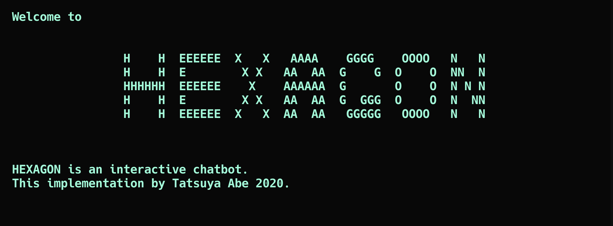

HEXAGON
=======

[](LICENSE)



## Description
This program is a interactive natural-language chatbot. A chatbot is a program that responds to user questions. In this project, we are developing with emphasis on "Humanity".


## Requirements
- MacOS
- Python 3.7.5


## Usage
### Start an interactive bot
```sh
$ python hexagon.py
```
## Train
```sh
$ python train.py
```


## Installation
```sh
$ git clone https://github.com/AjxLab/hexagon
$ cd hexagon
```


## Contributing
Bug reports and pull requests are welcome on GitHub at [https://github.com/AjxLab/hexagon](https://github.com/AjxLab/hexagon).


## Author
- name: Tatsuya Abe
- email: abe12@mccc.jp
