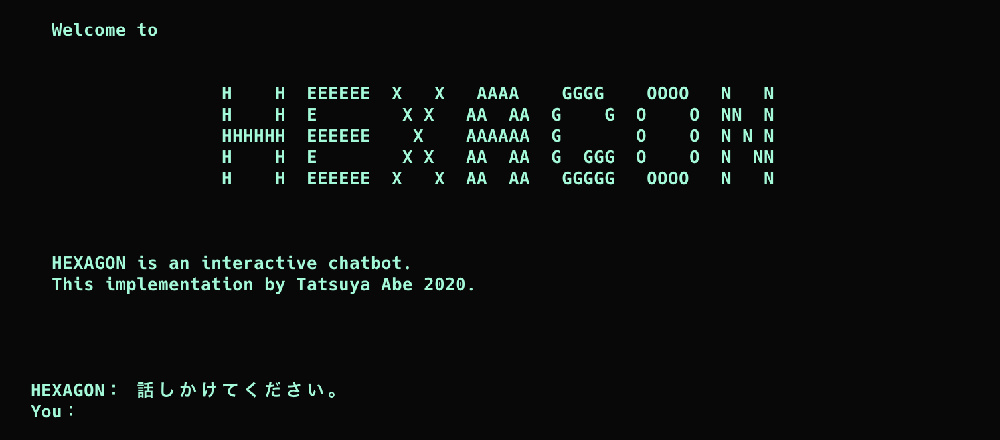

HEXAGON
=======

[](LICENSE)



## Description
This project is an interactive chatbot.

## Requirements
- MacOS
- Python 3.7.5


## Installation
```sh
$ git clone https://github.com/AjxLab/hexagon
$ cd hexagon
```


## Contributing
Bug reports and pull requests are welcome on GitHub at [https://github.com/AjxLab/hexagon](https://github.com/AjxLab/hexagon).


## Author
- name: Tatsuya Abe
- email: abe12@mccc.jp
